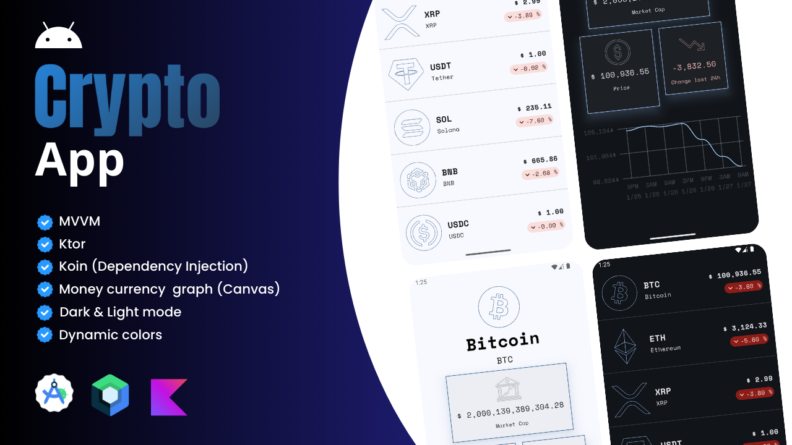

## ✨ Crypto App - Clean Architeture using MVVM

  

## 🧑‍💻 Architeture
This project follows the Philipp Lackner's course using **MVVM** pattern to separate concerns and promote modularity. Key practices include:
- State Management: ViewModels manage UI states efficiently, ensuring responsive and clean UI updates.
- Separation of Concerns: Clear distinction between UI logic, business logic, and data layers.
- Dependency Injection: **Koin** handles dependencies across the app, making it easier to test and manage.

## 🔥 Features
- API Communication: Uses **Ktor** for network requests and responses.
- Canvas: Draw a smooth graph displaying currency along the time
- Dynamic color: change app theme's based on the background of the user.
- Navigation: Implements the **Jetpack Adaptable Navigation** component for smooth transitions between screens.
